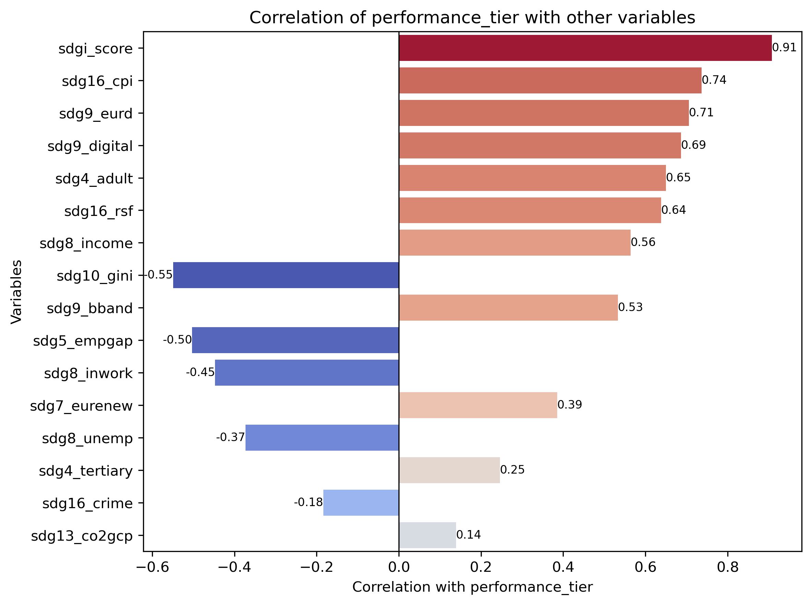
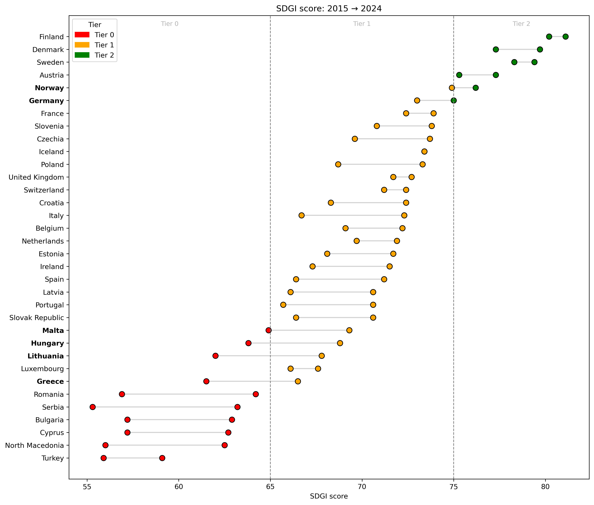

# Classifying EU Sustainability Performance — Machine Learning Analysis

## Overview
This project analyzes socioeconomic indicators across countries to classify them into performance tiers.  
It combines exploratory data analysis (EDA), feature engineering, and supervised machine learning to derive interpretable insights and policy implications.

The complete analysis is documented in the Jupyter notebook **`SPG_project_Final.ipynb`**.

---

## Data Exploration

A comprehensive exploratory data analysis was performed using **pandas**, **numpy**, **matplotlib**, and **seaborn**.  
Key steps included:

- Assessing missing values and variable distributions.  
- Identifying and handling outliers.  
- Imputing missing data using **subregion-level averages**, which proved more reliable than country-based imputation.  
- Exploring relationships between variables using correlation plots and pairwise visualizations.

| Variable              | Description                                                    | Unit in dataset                                 |
| --------------------- | -------------------------------------------------------------- | ----------------------------------------------- |
| **year**              | Year of observation                                            | year (2015–2024)                                |
| **sdgi\_score**       | SDG Index (aggregate sustainability performance score)         | scale 0–100                                     |
| **performance\_tier** | Sustainability performance classification                      | 0 = Needs Improvement, 1 = Good, 2 = Leaders    |
| **sdg8\_income**      | Average income per capita (GDP per capita, PPP)                | € per person (≈ 8,800 – 39,000)                 |
| **sdg8\_unemp**       | Unemployment rate                                              | % of population (2 – 26%)                       |
| **sdg8\_inwork**      | Employment-to-population ratio                                 | % of population (3 – 19%)                       |
| **sdg9\_eurd**        | Expenditure on R\&D                                            | % of GDP (0 – 4%)                               |
| **sdg9\_digital**     | Basic digital skills of the population                         | % of population (28 – 83%)                      |
| **sdg9\_bband**       | Broadband internet coverage                                    | % of households (59 – 100%)                     |
| **sdg16\_cpi**        | Corruption Perception Index (Transparency International)       | scale 0–100 (34 – 91; higher = less corruption) |
| **sdg16\_rsf**        | Press Freedom Index (Reporters Without Borders)                | scale 0–100 (32 – 95; higher = freer press)     |
| **sdg16\_crime**      | Crime/Safety index                                             | normalized index 1–26 (lower = less crime)      |
| **sdg4\_tertiary**    | Population with tertiary education                             | % of adults (23 – 63%)                          |
| **sdg4\_adult**       | Adult participation in education/training                      | % of adults (1 – 39%)                           |
| **sdg7\_eurenew**     | Share of renewable energy in final energy consumption          | % (5 – 84%)                                     |
| **sdg13\_co2gcp**     | CO₂ emissions per capita                                       | tons CO₂ per person (≈ 3 – 16.6)                |
| **sdg5\_empgap**      | Gender employment gap                                          | % difference between men and women (0 – 43%)    |
| **sdg10\_gini**       | Gini coefficient (income inequality)                           | 21 – 45 (scale typical for Europe)              |

  
---

## Machine Learning Task
A complete ML pipeline was implemented with a focus on interpretability and robustness.

**Pipeline Components**
- Feature preprocessing (scaling, encoding, imputation)
- Model training: Logistic Regression (with regularization), Random Forest
- Hyperparameter tuning via grid/randomized search
- Cross-validation and performance evaluation

## Results and Insights
### Tier Characterization Table
| Category | Tier 0 – "Needs Improvement" | Tier 1 – "Good" | Tier 2 – "Leaders" |
|----------|-------------------------------|-----------------|--------------------|
| **Institutional quality and governance** | High corruption, low press freedom, high crime → weak institutions. | Moderate corruption and governance; uneven progress in press freedom and safety. | Low corruption, strong rule of law, free press, safe environments. |
| **Economic structure and innovation** | Low income (€9k–15k PPP), minimal R&D (<0.5% GDP), high unemployment (>15%). | Middle-income (€15k–25k), moderate R&D (0.5–1.5%), unemployment 7–15%. | High income (>€25k), high R&D (>2%), low unemployment (<7%). |
| **Human capital and social inclusion** | Low digital skills (<40%), weak adult training (<10%), tertiary education <30%, large gender gaps (>20 pp). | Digital skills 50–65%, adult training 10–20%, tertiary education 30–45%, gender gap 10–20 pp. | High digital skills (>65%), adult training >20%, tertiary education >45%, gender gap <10 pp. |
| **Inequality and social balance** | High income inequality (Gini 35–45). | Moderate inequality (Gini 30–35). | Low inequality (Gini 22–30). |
| **Infrastructure and digitalization** | Broadband <70%. | Broadband 70–90%. | Broadband >90%. |
| **Environmental sustainability** | Low renewables (<20%), high CO₂ emissions (8–16 t). | Renewables 20–40%, CO₂ 6–10 t. | Renewables >40%, CO₂ 3–6 t. |
| **Distribution shapes (KDE insights)** | Peaks left for positive indicators, right/up for negatives. | Broader, sometimes bimodal peaks → heterogeneity within the group. Bimodality (R&D, adult training, gender gap, tertiary education, CO₂) shows Tier 1 is split into two subgroups: one closer to Tier 2, another leaning back toward Tier 0. | Clear right-shifts for positives, left-shifts for negatives → consolidated leaders. |
| **SDG Index** | • SDGI range: 55–65 <br> •  Сountries with significant gaps in achieving the SDGs | • SDGI range: 65–75 (peak at 70–72) <br> • Stable middle-level progress | • SDGI range: 75–82 <br> • Leaders, close to achieving most SDGs |
| **Economic interpretation** | Economies stuck in a development trap: weak institutions, low income, high inequality, poor innovation, high ecological footprint. | Economies at a crossroads: some advancing toward innovation and inclusion, others stagnating — explaining the bimodal distributions. | Economies with consolidated leadership: strong institutions, high innovation, inclusive labor markets, low inequality, and sustainable ecological policies. |
| **Summary** | Structurally constrained, high-risk economies. | Heterogeneous transitional group, with both “catch-up” and “lagging” trajectories. | Consolidated leaders combining prosperity, innovation, social inclusion, and sustainability. |


## Temporal and Regional Analysis
A separate analysis compared performance trends across **regions and performance tiers** over time,  
revealing shifts in socioeconomic patterns and development clusters.

  

---
## Repository Structure
The project directory is organized as follows:
```
Classifying_EU_Sustainability_Performance/
│
├── SPG_project_Final.ipynb # Main Jupyter notebook containing data analysis, ML pipeline, and results
├── README.md # Main project documentation (this file)
├── .gitattributes # Git configuration file for consistent file handling
│
├── data/ # Source and processed data files used for analysis
├── plots/ # Exported figures and visualizations featured in the README
├── aditional materials/ # Supplementary datasets, reports, or resources
├── policy_analysis/ # Policy insight tables and interpretation results
└── use_case_documentation/ # Use case description, methodology, and applied context documentation
```
---

### Notes

- **`SPG_project_Final.ipynb`** — contains the complete workflow: data exploration, feature engineering, modeling, and insights.  
- **`data/`** — stores the input data used for sustainability and performance metrics.  
- **`plots/`** — includes all key plots exported from the notebook (ready for publication or README embedding).  
- **`policy_analysis/`** — holds tables, regional breakdowns, and qualitative analyses supporting policy conclusions.  
- **`use_case_documentation/`** — contains use-case explanations, problem framing, and AI application context.  
- **`aditional materials/`** — additional reference materials or supplementary files.  
- **`README.md`** — explains the project’s purpose, workflow, and results for readers and collaborators.

---

## Use Case and Policy Implications
This project demonstrates how an ML pipeline can be translated into a meaningful **use case** for socioeconomic analysis.  
Results can inform:
- Regional development strategies  
- Policy prioritization based on performance tiers  
- Benchmarking and progress tracking for international programs

---

## Technical Stack
- **Python**: pandas, numpy, matplotlib, seaborn, scikit-learn
- **Environment**: Jupyter Notebook  
- **Version Control**: Git & GitHub  

---

## Author
**Valentyna Lavrenchuk**  
Contact: lavrenchuk.v.an@gmail.com  
Affiliation: Kiron Open Higher Education / Applied AI upskilling program "Thrive" / Applied AI Institute for Europe
